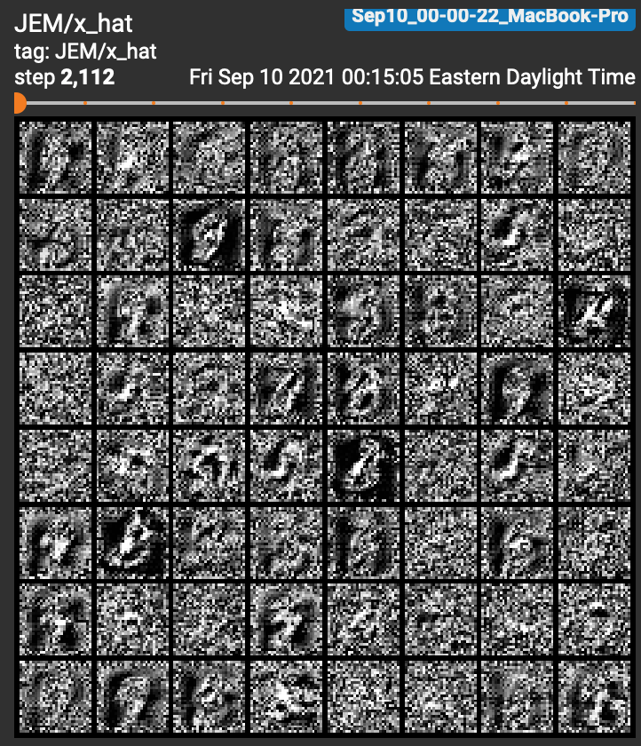

# sgld-nrg
Implements Stochastic gradient Langevin dynamics for energy-based models, as per https://arxiv.org/pdf/1912.03263.pdf

The basic usage is `python scripts/mnist_pretrian.py`. Use `python scripts/mnist_pretrian.py -h` to print the command-line options.

# Why this is cool

This paper discovers that classifier networks contain an extra degree of freedom in the logits of their predictions. This extra degree of freedom allows us to model the data distribution p(X). This allows researchers to realize the long-promised benefits of generative neural networks: out-of-distribution detection, model calibration, and adversarial robustness, while the classifier itself remains very effective.

This repository implements SGLD and energy-based training for classifier networks on common toy datasets. One side-effect of SGLD training is that the classifier network itself can also be used as part of a generative MCMC mechanism. In this sense, classifier networks are also generative models.

These are 64 samples from young MCMC chains at the start of training the energy model. There are some vaguely-digit-shaped blobs among the random noise. They're blurry noisy because they are initialized from uniform random noise, and only gradually refined based on the gradient of its energy wrt the image (i.e. SGLD). Further evolution and computing gradients from model trained to optimize energy will improve them.

These are 64 samples from older MCMC chains. After using energy-based training for about half an epoch and evolving the chains during that time, they are recognizable as digits for the most part. Some of the images are fuzzier than others due to re-initialization to random noise.

# Loss progression using pre-training

These plots show the evolution of the loss:
- `JEM/total` tracks the total loss crossentropy(y_hat, y) + E(x) - E(x_hat);
- `JEM/nrg` tracks the energy poriton of the loss E(x) - E(x_hat);
- `JEM/xe` tracks the classifier lostt (cross-entropy loss).

This plot shows the loss of the neural network using energy-based training after the neural network has been pre-trained for 3 epochs solely as a classifier. This accounts for why the initial cross-entropy loss starts so close to 0.0, and then rises; likewise, this accounts for why the energy portion of the loss is so high: during pre-training, there was no penalty to increasing the energy of the data, for the simple reason that the energy E(x) is not measured by a classifier. An interesting development is that at a certain point, the model appears to stabilize around a total loss slightly less than 1.0, roughly evenly divided between the classifier porition and the energy portion.

# JEM without pre-training

Without pretraining, it's challenging to interpret the total loss on its own. It almost appears as if the model is getting worse over time because the loss is increasing. This shows about 7 epochs of training with `batch_size=4`. The cross-entropy loss and accuracy abysmal until deep into the training, whereas an ordinary classification network typically tops 90% accuracy in the first few batches, and certainly by the end of the first epoch. However, we can verify that things are working by visually inspecting the resulting images sampled from the model; by 5,000 training images seen, there are recognizable image-shaped blurs among the samples. By 10,000 training images seen, the sample are look like sloppy handwritten digits. 

Partially, this increasing loss pattern is because it takes many MCMC steps for SGLD to refine the generated images from noise into something that looks reasonably like a digit. Because the model is refining its conception of what a digit is alongside learning the density of the data, it is slow-going, and the loss appears to reflect the shifting priorities of the model over time, alternating between reducing the cross-entropy and reducing the energy. This zoomed-in view of early training makes this effect clearer: for a long duration, the cross-entropy loss is barely improving for the first 25,000 samples seen, while the total loss is **increasing**, and the accuracy is struggling to beat 70%.

# My TODO list

As of this commit, the repository is solely a proof-of-concept implementation based on the details in the paper. My TODO list includes
- ~~creating a package with suitable objects for general use~~
- ~~implementing mini-batching for SGLD~~
- ~~improving the SGLD implementation itself for reproducibility and speed (allow users to set random seed, use a `torch.Tensor` to store the buffer instead of a list)~~
- ~~improving the argparse interface to allow more fine-grained control of the model estimation (lots of things are hard-coded now)~~
- ~~testing whether the models still work if we jettison the classifier-only pre-training and buffer initialization (these were implemented as a way to validate that the JEM model could actually do what we needed in the _best possible circumstances_, i.e. having a pretty good classifier off the bat to start JEM training)~~
- apply JEM to problems that are harder than MNIST digits (MNIST digits is know to be an easy task for CNNs, so it's a nice place to start for proof-of-concept code).
